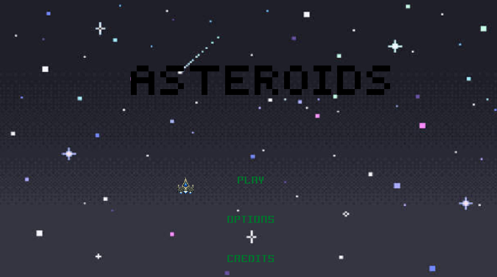

## ASTEROIDS

### Description

PAC 1. A Raylib based version of the classic arcade game "Asteroids"

### Controls

Keyboard:
 - WASD or key arrows

### Screenshots

### Developers

 - Francisco José Palacios Márquez

### License

This game sources are licensed under an unmodified zlib/libpng license, which is an OSI-certified, BSD-like license that allows static linking with closed source software. Check [LICENSE](LICENSE) for further details.
